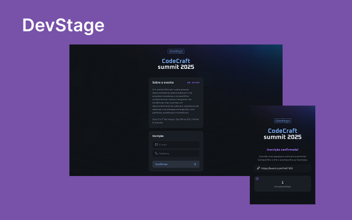

# DevStage

## 🚀 Tecnologias

Este projeto foi desenvolvido com as seguintes tecnologias:
- HTML
- CSS
- JavaScript
- Figma

## 📂 Estrutura do Projeto
DevStage é um projeto Full Stack desenvolvido durante o evento NLW Connect da Rocketseat. Ele consiste em uma plataforma para inscrição de presença em eventos, oferecendo uma interface moderna.

